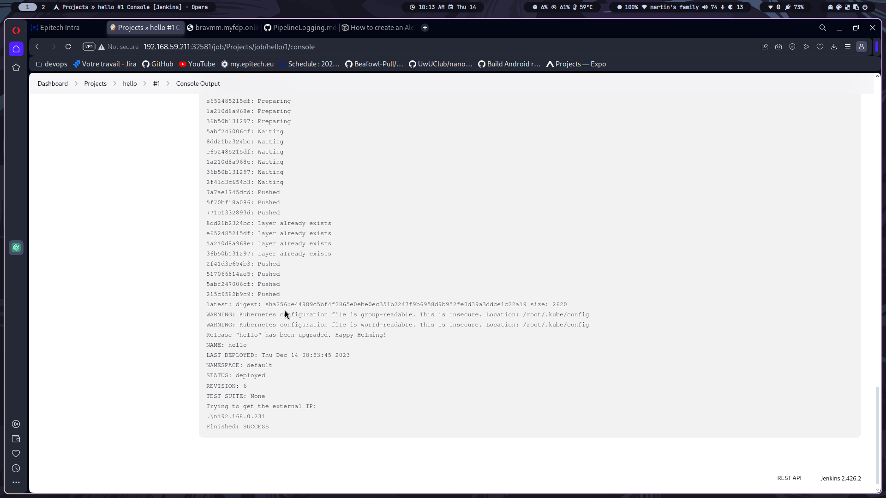

# Running your own whanos instance
There is to way to create and manage your own whanos instance:

- Using [docker](#docker)
    - [Requirements](#requirements)
    - [Cloning the repository](#cloning-the-repository)
    - [Running the project](#running-the-project)
    - [Conclusion](#conclusion)
- Using [helm](#helm)
    - [Requirements](#requirements-1)
    - [Cloning the repository](#cloning-the-repository-1)
    - [Running the project](#running-the-project-1)
    - [Deleting the project](#deleting-the-project)
    - [To use the autodeploy feature](#to-use-the-autodeploy-feature)
    - [Conclusion](#conclusion-1)
- Using [autodeploy](#autodeploy)
    - [Requirements](#requirements-2)
    - [To use the autodeploy feature](#to-use-the-autodeploy-feature-1)
- Using [docker registry](#docker-registry)
    - [Usage](#usage)
- Using [jenkins](#jenkins)
    - [How to use Jenkins](#how-to-use-jenkins)
        - [Build the docker images](#build-the-docker-images)
        - [Build your personal project](#build-your-personal-project)

## Docker
### Requirements
- Docker
- Docker-compose
- Git

### Cloning the repository
```bash
git clone git@github.com:Beafowl-Pull/Whanos.git
cd Whanos
```

now that the repository is cloned, you need to create a `.env` file in the root of the project with the following content:
```bash
JENKINS_ADMIN_PASSWORD, #it will be the password for the admin user
JENKINS_DOCKER_REGISTRY, #it will be the docker registry base url
```

### Running the project
```bash
docker-compose up --build
```

### Conclusion
Your whanos instance is now running on `http://localhost:8080` and you can login with the admin user and the password you set in the `.env` file.

## Helm
### Requirements
- Helm
- kubectl
- Having a load balancer available (for example [metallb](https://metallb.universe.tf/))

### Cloning the repository
```bash
git clone git@github.com:Beafowl-Pull/Whanos.git
cd Whanos
```

now that the repository is cloned, you need to fill the `value.yaml` file in the `helm/Whanos` folder:
```yaml
whanos:
  jenkins:
    # the repository to pull the jenkins image created by docker build . (at the root of the repo)
    image: 
    # the password has to be encoded in base64
    password: 
  docker:
    # this is the docker registry base url
    registry:
    # by default another pod is running using dind
    host: tcp://dind-service:2375
```

### Running the project
Everything you have to do is to run the following command:
```bash
sh ./launch_helm.sh
```

### Deleting the project
Everything you have to do is to run the following command:
```bash
sh ./clean_helm.sh
```

### Conclusion
Your whanos instance is now running, you can access to it using the ip given at the end of the script.

## Autodeploy

### Requirements
- Having a domain name / ip
- Having a docker registry
- Having a kubernetes cluster
- Having a load balancer available (for example [metallb](https://metallb.universe.tf/))

### To use the autodeploy feature
Everything is already set up, you just have to modify the ./utils/config file with your own configuration:
```bash
apiVersion: v1
clusters:
- cluster:
    extensions:
    - extension:
        last-update: Mon, 04 Dec 2023 10:04:00 UTC
        provider: minikube.sigs.k8s.io
        version: v1.32.0
      name: cluster_info
    server: http://<your user>:<your password>@<your ip/domain>:<your port>
  name: minikube
contexts:
- context:
    cluster: minikube
    extensions:
    - extension:
        last-update: Mon, 04 Dec 2023 10:04:00 UTC
        provider: minikube.sigs.k8s.io
        version: v1.32.0
      name: context_info
    namespace: default
    user: <your user>
  name: minikube
current-context: minikube
kind: Config
preferences: {}
```
All the fields to fill are the configuration of your kubernetes cluster, you can find them in the `~/.kube/config` file on your cluster/server.

## Docker Registry

### Usage
If you have a local or personal docker registry and ssl is not enabled, you need to modify the ./utils/daemon.json file with your own configuration:
```bash
{
  "insecure-registries" : ["<your ip/domain>:<your port>"]
}
```

## Jenkins

### How to use Jenkins


#### Build the docker images
To build the docker images, all you have to do is go to the directory "Whanos base image" and click on the little arrow next to "Build all base images" and click on "Build Now"


and after a few seconds, you will see the result of the build:


#### Build your personal project

To build your personal project, all you have to do is go to the directory "Link-project" and click on "Build with parameters", then you will have to fill in the parameters:


```bash
GIT_URL: the url of your git repository (ex: https://github.com/Beafowl-Pull/ts-hello-world.git)
DISPLAY_NAME: the name of your project (ex: hello)
```

> **Warning**
> The name of your project must be unique, if you try to build a project with a name that already exists, the build will fail.

> **Warning**
> The name should not contain any special characters and spaces, only letters and numbers are allowed.

When you have filled in the parameters, you can click on "Build" and after a few seconds, your project should be built.

Now you can go to the "Project" directory and click on the name of your project, if your project hasn't build yet, don't hesitate to click on build now.


If you want to see the logs of your build, you can click on the number of the build and you will see the logs of your build.

If your repository contain a whanos.yml file, your project will be deployed on your kubernetes cluster.
To see the ip given by the load balancer, you can go in the logs of your build and you will see the ip.



now you can go to the ip given by the logs or enter your domain and you will see your project running (don't miss the port).


> **Warning**
> If you want to deploy your project on your kubernetes cluster, you need to have a docker registry and you need to modify the ./utils/config file with your own configuration.
> You can find the configuration of your kubernetes cluster in the `~/.kube/config` file on your cluster/server.
